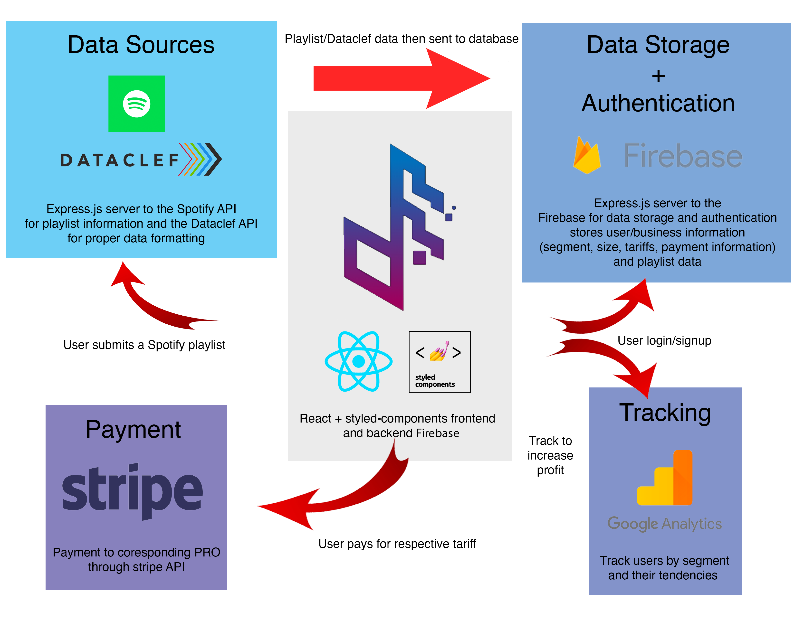

# Try Studio

Try Studio is a company founded in the Software for the Global Music Business industry. Try Studio aims to provide a one-stop shop for music licensing.

Table of Contents
---

- [People](./team/)
- [Diversity](./team/diversity.md)
- [Product & Research](./product_research/)
    - [Architecture Diagram](./product_research/architecture_diagram.md)
    - [Roadmap](./product_research/roadmap.md)
   
People at Try Studio
---

- [Darren Moore, Computer Science](./team/darren_moore.md)
- [Ryan Ro, Computer Science](./team/ryan_ro.md)
- [Tianquan Di, Computer Science](./team/tianquan_di.md)
- [Tim Zhang, Computer Science](./team/tim_zhang.md)
- [Yuhao Kan, Computer Science](./team/yuhao_kan.md)

# Architecture Diagram

Further stack details on [StackShare](https://stackshare.io/dcsil/try-studio)
