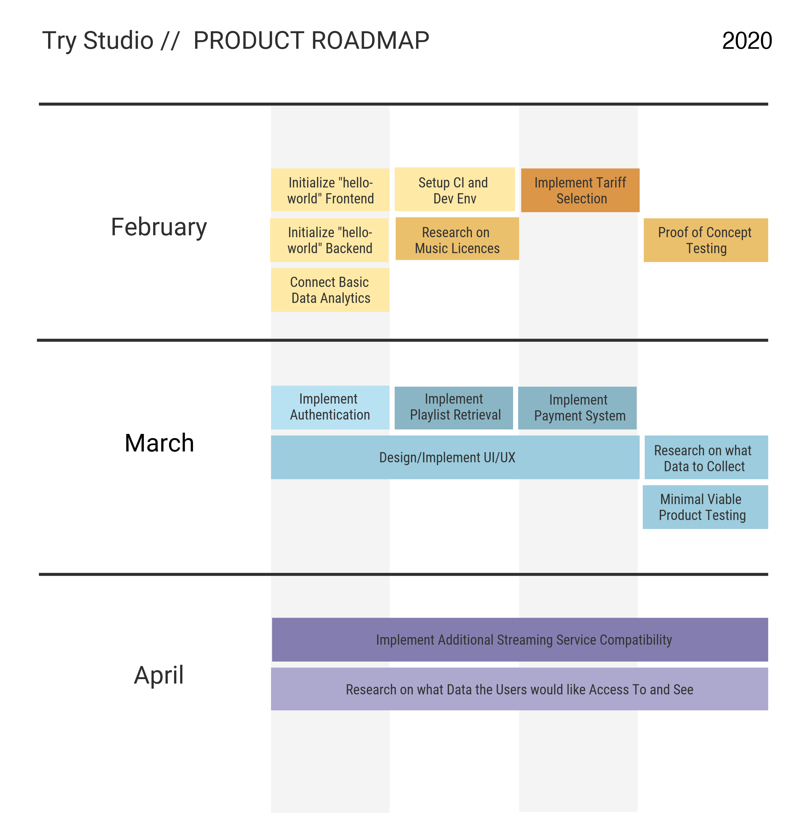

# Roadmap

In summary, a proof of concept will be ready by the end of February, a minimum viable product will ship by the end of March, and the business will focus on scaling and expanding April.

Further roadmap details on [Github Projects](https://github.com/dcsil/try-studio/projects)
- [Technology Roadmap](https://github.com/dcsil/try-studio/projects/1)
- [Business Roadmap](https://github.com/dcsil/try-studio/projects/2)
