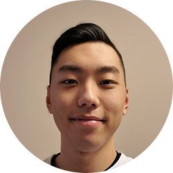

# Ryan Ro

- 4th Year (+ PEY) Undergraduate Student at University of Toronto
- ryan@ryanro.me

## Links

- [GitHub](https://github.com/ryanro97)
- [LinkedIn](https://www.linkedin.com/in/ryanro97/)
- [Website](https://ryanro.me)
- [Resume](https://ryanro.me/resume)

## About Ryan

Ryan is from Vancouver, Canada, where he spent his whole life before pursuing post-secondary education. He enjoys creating practical things, whether it be software, or hardware. He has worked as a full stack sofware developer, and a teaching assistant, which has led him to be comfortable in many computer languages. An avid animal lover, he hopes to get a dog in the near future. In his spare time, he enjoys playing sports, in particular basketball, and having being relatively restricted to Canada, wishes to travel to world.

## Strengths

- Strong leadership skills
- Good at problem solving
- Experience working in a startup

## Weaknesses

- Headstrong and sometimes hard to convince
- Sometimes spends more time than needed on the little things
- Sporadic sleep schedule