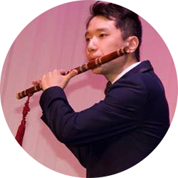

# Tianquan "Andy" Di

- 3rd Year Undergraduate Student at University of Toronto
- tianquan.di@mail.utoronto.ca

## Links

- [GitHub](https://github.com/AndyTQ)
- [LinkedIn](https://www.linkedin.com/in/andy-tianquan-di-54b712122/)
- [Website](https://andydi.com)
- [Resume](https://andydi.com/resume.pdf)
- [SoundCloud](https://soundcloud.com/andytq)

## About Andy

Andy is an undergraduate student at University of Toronto, who is passionate in software development, video game design and music performance. Before co-founding Try Studio, Andy has worked with Professor Steve Engels (Professor at Department of Computer Science, University of Toronto) on educational video game research. He has independently developed an Unity3D-based roller coaster game that teachers secondary school students about graphing functions. In Andy's spare time, he plays Minecraft and Counter-Strike: Global Offensive.

Andy moved from Nanjing, China to Regina, Saskatchewan when he was 13. He started playing Chinese flute since 6. Andy is experienced at performing flute solos at major school events. He also recorded a number of sound tracks and uploaded them to his SoundCloud channel. Besides playing flute, Andy is also a Baritone singer at Faculty of Music, University of Toronto. 

## Strengths

- Large amonut of experience in performing arts, including playing flute and singing. 14 years of experience in flute playing and 10+ years of experience in music performance. Andy is also strong at delivering hapiness and a joyful mood to the team through power of music.
- Strong programming skill and experience in game development. 
- Passionate about **both software and music**. Capable of bringing the same level of high passion and motivation to everyone on the team.

## Weaknesses

- Andy need to learn more on working sustainablly. He sometimes does not care about his health condition while working.
- Andy does not have a very strong backgroud in business. He need to gain more experience in market analysis, ideation, and many other ways to create a good startup.
- Sometimes, Andy is afraid to point out the weakness of the team, for the sake of trying to save other's feelings. Andy need to have more courage and raise up the problem on the team so that everybody on the team can solve the problem cooperatively.
